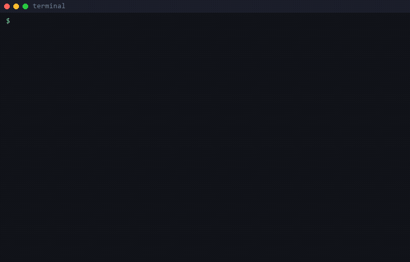

# Token Triage

**Find your Claude Code burn before your bill does.**

`token-triage` is a small, local-only CLI that reads the event logs Claude Code
already writes to `~/.claude/projects/` and turns them into a ranked report:
where your tokens went, which sessions ran the hottest, which model tier got
which work, and which patterns are quietly inflating your bill.

It runs entirely on your machine. Nothing is uploaded, nothing phones home,
nothing is cached on a third-party server. If you can't ship raw session logs
to a SaaS dashboard for compliance reasons, this is built for you.

## Field study: 30 days of real spend

I pointed `token-triage` at my own fleet for a month: **34,533 turns, $11,737**
in API-equivalent cost. The shape was the surprise. **92.5% of every token
was a cache *read*** (the accumulated context, re-read on every turn), while the
prompts I actually type were **0.17%**. The run also caught the tool pricing its
own most-expensive model at **$0**, the bug that became the thesis.

Full writeup, with the by-bucket and by-model numbers:
**[STUDY.md](STUDY.md)**.

## What it tells you

- **Total spend** in USD across your activity, broken out by model tier (Opus /
  Sonnet / Haiku) and by token bucket (input, cache write, cache read, output).
- **Top projects by cost** with per-project cache hit ratio and session counts.
- **Hottest 5-hour windows.** Sliding-window detection so the periods that
  align with Anthropic Max billing blocks pop out, not just calendar days.
- **Model breakdown.** Cost share and call share per model, so you can tell at
  a glance whether your routing matches your intent. Models the rates table
  cannot price are flagged **(unpriced)** instead of silently costing $0.00.
- **Ranked findings.** Opinionated callouts for the patterns that most often
  drive surprise bills:
  - Opus calls with short outputs (the textbook Sonnet-fits-here case)
  - Low cache-hit ratios on high-spend projects
  - Single sessions that dominate total spend
  - All-routing-on-one-tier mixes

A full report against a synthetic dataset lives at
[`examples/sample-output.md`](examples/sample-output.md).



## Install

`token-triage` ships as a single Python package with **zero runtime
dependencies** beyond the standard library. Not on PyPI yet; install straight
from GitHub with `pipx` (recommended) or `pip`:

```bash
pipx install git+https://github.com/cursed180/Cursed_Token_Triage.git
# or
pip install git+https://github.com/cursed180/Cursed_Token_Triage.git
```

Requires Python 3.10+.

## Quickstart

Audit everything Claude Code has logged:

```bash
token-triage
```

Not sure what the output looks like first?
[`examples/sample-output.md`](examples/sample-output.md) is a full report
rendered against a synthetic dataset.

Just the last week, JSON for piping into other tools:

```bash
token-triage --since 7d --format json > triage-week.json
```

Anonymize project paths and session ids before sharing a screenshot:

```bash
token-triage --anon --output triage-anon.md
```

Use a different rates table (Bedrock, Vertex, negotiated discount):

```bash
token-triage --rates my-rates.json
```

A rates file looks like:

```json
{
  "claude-opus-4-7": {
    "input": 4.5,
    "cache_write_5m": 5.625,
    "cache_write_1h": 9.0,
    "cache_read": 0.45,
    "output": 22.5
  }
}
```

Any model not in the override falls back to the built-in defaults. Published
rates change often; pin yours with `--rates` rather than trusting the
built-ins to stay current.

Three guards keep stale pricing visible instead of silent:

1. Every report header prints the as-of date of the built-in table.
2. Models the table cannot price are flagged **(unpriced)** in the report and
   warned about on stderr. Add `--strict` to turn that into exit code `3` for
   CI gates.
3. A weekly `rates-drift` GitHub Actions job in this repo diffs the built-ins
   against Anthropic's published pricing and files an issue on any mismatch,
   including when the check itself cannot run.

The drift check runs in this repo's CI, never on your machine. The installed
package still makes no network calls.

### Useful flags

| Flag | Default | Notes |
| --- | --- | --- |
| `--projects-dir DIR` | `~/.claude/projects` | Point at a different projects tree (custom installs, archived logs). |
| `--force` | off | Overwrite an existing `--output` file. Without this the exit code is `2`. |
| `--since 7d` / `--since 24h` / `--since 2026-04-01T00:00:00Z` | unbounded | Filter by recency. |
| `--format markdown\|json` | `markdown` | Markdown for humans, JSON for machines. |
| `--output PATH` | stdout | Write to a file instead. |
| `--rates rates.json` | built-ins | Override per-model pricing. |
| `--strict` | off | Exit `3` if any model has calls but no rates entry (for CI gates). |
| `--anon` | off | Replace project paths and session ids with stable opaque hashes. |
| `--top N` | 10 | Number of projects in the top-projects table. |
| `--windows N` | 5 | Number of 5-hour windows to surface. |

## Privacy

This tool is built for engineers and teams who can't share session logs with a
third party. The promise is simple and testable:

- **Local-only by design.** The CLI reads files under `~/.claude/projects/` on
  your machine. There is no `--upload`, no opt-in telemetry, no auto-update
  ping.
- **Zero runtime dependencies.** The package depends only on the Python
  standard library, so there is no transitive supply chain to audit.
- **No network code in the package.** A privacy-scrub check (run in CI and as a
  pre-commit hook) fails the build if anything under `token_triage/` imports
  `requests`, `httpx`, `urllib`, `socket`, `http.client`, or other
  network-capable modules. See [`scripts/privacy_scrub.py`](scripts/privacy_scrub.py).
  The scrub is a static pattern check; dynamic-import bypasses
  (`__import__('socket')`, `importlib.import_module(...)`) are not caught,
  so review the diff alongside the scrub.
- **Aggregate output.** Reports contain token counts and timestamps, never raw
  prompts, conversation content, file contents, or tool I/O.
- **Anonymization on demand.** `--anon` replaces project paths and session ids
  with stable hashes so you can paste the report into a chat or PR without
  leaking project names.

If you're reviewing this tool to decide whether to allow it in a regulated
environment, the relevant invariants are:

1. The CLI takes only local file paths. It opens no sockets.
2. No background process is started; there is no daemon.
3. The package wheel ships only the `token_triage` Python sources and a
   console-script entry point.

## How it computes cost

The audit reads Anthropic-style `usage` blocks out of each assistant turn:
input tokens, cache-write tokens (5m / 1h), cache-read tokens, and output
tokens. Each bucket is multiplied by the matching per-million rate for the
model that turn used. Costs are summed per project, per session, per 5h
sliding window, and per model.

The built-in rate table mirrors [Anthropic's published API
pricing](https://platform.claude.com/docs/en/about-claude/pricing). Its as-of
date ships as `RATES_AS_OF` in `token_triage/pricing.py` and prints in every
report header. Rates change; pin yours with `--rates`. The weekly `rates-drift`
workflow re-checks the table against the published doc and opens an issue when
they disagree.

## What it doesn't do (yet)

- Cursor / Continue / other agent harnesses. Only Claude Code's `*.jsonl`
  format is parsed today.
- Per-tool-call breakdown. The analysis is at the per-turn level.
- Trend charts or a dashboard. The output is a flat report.

PRs welcome on any of these; [open an issue](https://github.com/cursed180/Cursed_Token_Triage/issues)
to discuss before sending a large one.

## Prior art

[ccusage](https://github.com/ryoppippi/ccusage) parses the same logs and is
worth knowing about. `token-triage` differs in three ways: zero runtime
dependencies (stdlib only), a CI-enforced ban on network imports inside the
package source as the testable form of the no-telemetry promise, and an
opinionated findings layer on top of the raw aggregates.

## Contributing

```bash
git clone https://github.com/cursed180/Cursed_Token_Triage
cd Cursed_Token_Triage
python -m venv .venv && source .venv/bin/activate
pip install -e '.[dev]'
pytest
ruff check .
ruff format --check .
python scripts/privacy_scrub.py
```

The privacy scrub also runs as a pre-commit hook (see
[`.pre-commit-config.yaml`](.pre-commit-config.yaml)) and in CI on every push.

**Privacy-scrub config**

Personal/namespace patterns are loaded from a local config that lives **outside
the repository** and is never committed to any repo, public or private. Create
`~/.config/token-triage/scrub-patterns.json` (or `.yaml` if PyYAML is
installed):

```json
{
  "path_patterns": [
    {
      "pattern": "/home/(?!user\\b|devuser\\b|runner\\b|ubuntu\\b)[A-Za-z0-9_.-]+",
      "description": "operator-style /home/<user> path",
      "allowlist": []
    },
    {
      "pattern": "/Users/(?!user\\b|runner\\b)[A-Za-z0-9_.-]+",
      "description": "operator-style /Users/<user> path (macOS)",
      "allowlist": []
    },
    {
      "pattern": "\\.claude/projects/-[A-Za-z0-9_-]+",
      "description": "real Claude Code project slug",
      "allowlist": []
    }
  ],
  "namespace_patterns": [
    {
      "pattern": "\\bMYNS_(?!ThisRepo\\b)[A-Za-z][A-Za-z0-9_]*",
      "description": "sibling-namespace project reference"
    },
    {
      "pattern": "\\bMyRealName\\b",
      "description": "operator real name",
      "ignorecase": true
    }
  ]
}
```

If the config is absent the script still enforces DSN and network-import checks,
but emits a warning that personal patterns are disabled. Override the path with
`TOKEN_TRIAGE_SCRUB_CONFIG`.

**Pre-commit hooks** (ruff + privacy scrub + public content scan):

```bash
pip install pre-commit
pre-commit install
pre-commit install --hook-type commit-msg
```

The public content scan hooks require `cursed-public-scan` on PATH. If you
don't have it installed locally, skip those hooks with
`SKIP=cursed-public-scan,cursed-public-scan-commit-msg,scan-author-email`.

## License

[Apache-2.0](LICENSE). See [NOTICE](NOTICE) for attribution and
[CONTRIBUTING.md](CONTRIBUTING.md) for the contribution / DCO terms.

---

Maintained by [Ryan Doubrava](https://cursedagentic.com/). Want the audit run
and interpreted for you: [setup.cursedagentic.com](https://setup.cursedagentic.com/).
